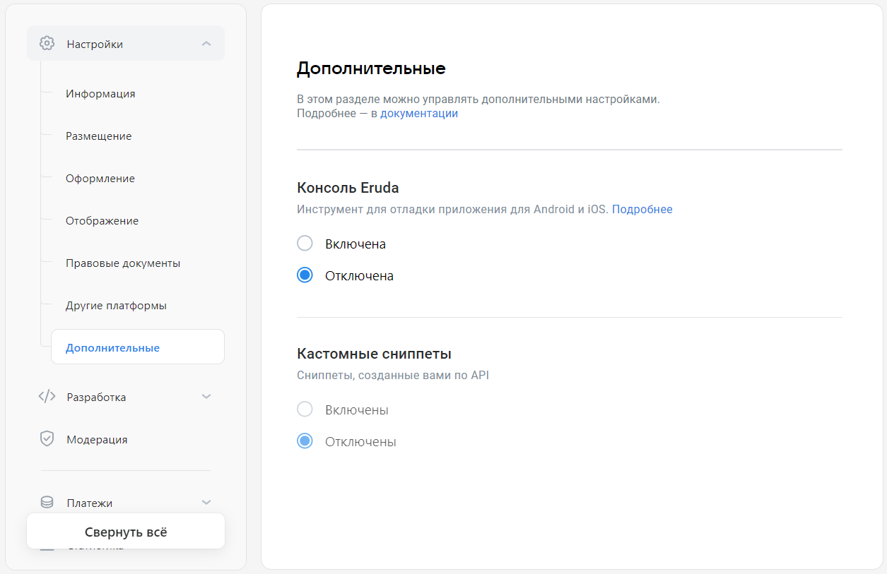

# Дополнительные

В этом разделе вы можете указать дополнительные настройки, которые используются для отладки и работы мини-приложения на платформе.

## Как открыть

[Откройте панель управления мини-приложением](mini-apps/settings/overview) и в меню слева выберите **Настройки**&nbsp;&rarr; **Дополнительные**.

## Как выглядит

<!-- exclusions/_images/mini-apps/settings/general/additional-page.webp -->

## Кому доступно

Раздел доступен [администраторам](mini-apps/settings/managers) мини-приложения со следующими правами:

* Создатель мини-приложения.

* Администратор с полным доступом.

* Администратор с частичным доступом, с правом «Редактирование».

## Настройки

### Консоль Eruda

Консоль [Eruda](https://github.com/liriliri/eruda) упрощает отладку мини-приложений. Она подобна инструментам разработчика в браузерах и особенно полезна при создании и отладке мини-приложений, которые работают в мобильном приложении ВКонтакте для Android и iOS. Подробнее о консоли — в разделе [Отладка на мобильных устройствах](mini-apps/development/debugging#Отладка%20на%20мобильных%20устройствах).

В этом блоке вы можете подключить или отключить Eruda для своего мини-приложения. При включении Eruda в интерфейс мини-приложения автоматически добавится кнопка для вызова консоли. Писать какой-либо код для этого не нужно. Кнопка будет видна только [администраторам](mini-apps/settings/managers) мини-приложения и не видна другим пользователям.

### Кастомные сниппеты

[Сниппет](mini-apps/development/snippets) — блок с названием, описанием, изображением мини-приложения и кнопкой для запуска. ВКонтакте добавляет сниппеты к личным сообщениям или записям сообщества, если в них указана ссылка на мини-приложение.

Платформа может создать сниппет автоматически из настроек мини-приложения либо использовать сниппеты, которые вы создали с помощью API-запроса [`apps.addSnippet`](method/apps.addSnippet).

Настройка указывает вид сниппетов, которые платформа будет использовать:

* **Отключены** — Платформа будет использовать сниппет, созданный автоматически из настроек игры. Значение используется по умолчанию.

* **Включены** — Платформа будет использует сниппеты, созданные с помощью API-запроса [`apps.addSnippet`](method/apps.addSnippet), а также сниппет, созданный в настройках.

Подробности — в разделе [Сниппеты мини-приложений](mini-apps/development/snippets).

## Материалы по теме

* [Мини-приложения — Панель управления](mini-apps/settings/overview)

* [Отладка на мобильных устройствах](mini-apps/development/debugging#Отладка%20на%20мобильных%20устройствах)

* [Сниппеты мини-приложений](mini-apps/development/snippets)
