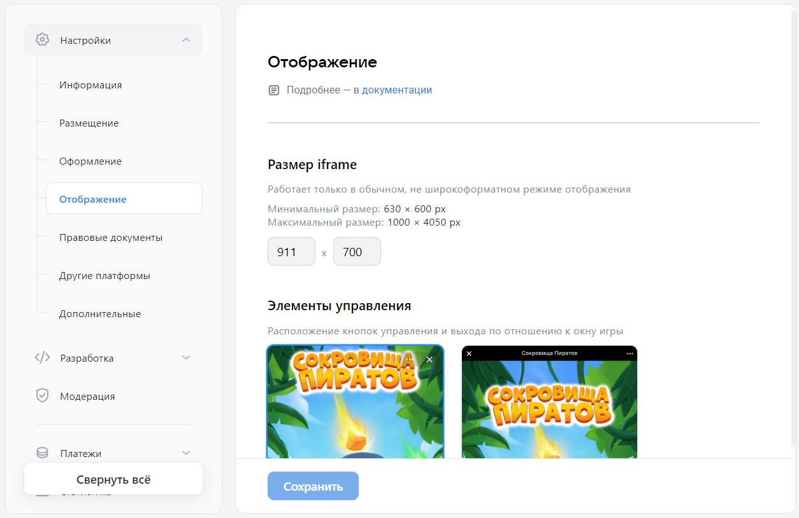

# Отображение

Раздел содержит настройки, которые влияют на отображение экрана мини-приложения.

## Как открыть

[Откройте панель управления мини-приложением](mini-apps/settings/overview) и в меню слева выберите **Настройки&nbsp;&rarr; Отображение**.

## Как выглядит

<!-- exclusions/_assetsmini-apps/settings/general/display-page.webp -->

## Кому доступно

Раздел доступен [администраторам](mini-apps/settings/managers) мини-приложения со следующими правами:

* Создатель игры.

* Администратор с полным доступом.

* Администратор с частичным доступом, с правом «Редактирование».

## Настройки

#### Размер iframe

Настройка используется для мини-приложений, которые запускаются из десктопной версии сайта ВКонтакте. Такие мини-приложения работают в HTML-элементе `<iframe>`. Настройка указывает высоту и ширину этого элемента.

Минимальный размер: 630&times;600 px.    
Максимальный размер: 1000&times;4500 px.

#### Элементы управления

Задаёт расположение элементов управления мини-приложением: кнопки вызова меню и кнопки закрытия.

| Значение | Описание |
| --- | --- |
| **Поверх окна** | Платформа ВКонтакте будет отображать элементы управления поверх окна мини-приложения. |
| **Над окном** | Платформа ВКонтакте будет отображать полосу с элементами управления в верхней части окна мини-приложения. Эта полоса не будет частью экрана мини-приложения. |

## Материалы по теме

* [Мини-приложения — Панель управления](mini-apps/settings/overview)

* [Настройки (старая панель управления)](mini-apps/management/settings)
