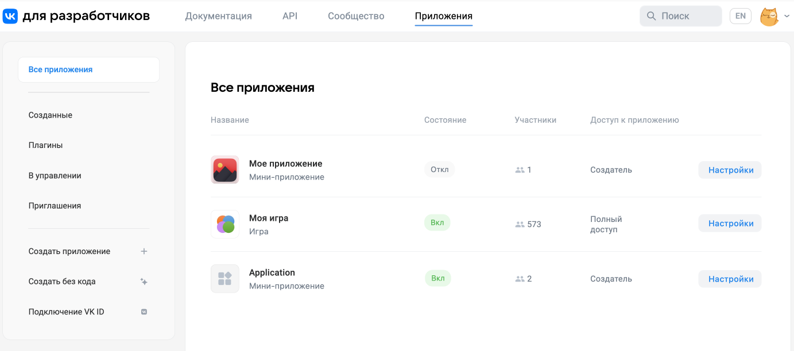

# Панель управления

При помощи новой панели управления вы можете создавать и настраивать мини-приложения ВКонтакте.

Чтобы открыть список доступных вам мини-приложений и игр, перейдите на портал для разработчиков — [dev.vk.com](https://dev.vk.com) — и выберите **Приложения** в верхнем меню. Либо откройте следующую страницу в браузере:

&nbsp;&nbsp;&nbsp;&nbsp;&#9658; https://dev.vk.com/admin/apps-list

Затем выберите приложение из списка и нажмите **Настройки**. Откроется панель управления мини-приложением.

:::note
По сравнению со старой панелью управления новая предлагает переработанный пользовательский интерфейс (UI), более подробную статистику и другие улучшения. 
Чтобы попасть в старую панель управления, используйте один из способов:
* Перейдите по [ссылке](https://vk.com/apps?act=manage).
* В настройках приложения в нижней части левого меню нажмите **Старая версия панели**.
:::

## Доступы

Настройки мини-приложения доступны пользователям, которые добавлены в [список администраторов](mini-apps/settings/managers). Администраторы могут иметь полный или частичный доступ к настройкам мини-приложения.

## Разделы

import Tabs from '@theme/Tabs';
import TabItem from '@theme/TabItem';

<Tabs>
  <TabItem value="mini-apps" label="Мини-приложения" default>
  Настройки мини-приложения сгруппированы в следующие разделы:
  * Настройки
    * [Информация](mini-apps/settings/general/information)
    * [Размещение](mini-apps/settings/general/placement)
    * [Оформление](mini-apps/settings/general/design)
    * [Отображение](mini-apps/settings/general/display)
    * [Правовые документы](mini-apps/settings/general/legal-docs)
    * [Другие платформы](mini-apps/settings/general/other-platforms)
    * [Дополнительные](mini-apps/settings/general/additional)
  * Разработка
    * [Ключи доступа](mini-apps/settings/development/keys)
    * [Хранимые&nbsp;процедуры](mini-apps/settings/development/stored-procedures)
  * [Модерация](mini-apps/settings/moderation)
  * [Монетизация](mini-apps/settings/monetization)
  * Платежи
    * [Подключение](mini-apps/settings/payments/setting-up)
    * [Транзакции](mini-apps/settings/payments/transactions)
    * [Вывод](mini-apps/settings/payments/withdrawal)
  * Статистика
    * [Аудитория](mini-apps/settings/stats/audience)
    * [Платежи](mini-apps/settings/stats/payments)
    * [Рекламная монетизация](mini-apps/settings/stats/monetization)
    * [Запросы к API](mini-apps/settings/stats/api-requests)
    * [Оптимизация](mini-apps/settings/stats/optimization)
  * Соц. механики
  * [Уведомления](mini-apps/settings/social-mechanics/notifications)
  * [События приложения](mini-apps/settings/history)
  * [Администраторы](mini-apps/settings/managers) и [Доступ к приложению](mini-apps/settings/access-to-app)
  * [Тестовые группы](mini-apps/settings/test-groups)
  * [Помощь](mini-apps/settings/help)

  </TabItem>
  <TabItem value="games" label="Игры">
  Настройки игры сгруппированы в следующие разделы:
  * Настройки
    * [Информация](games/settings/general/information)
    * [Размещение](games/settings/general/placement)
    * [Оформление](games/settings/general/design)
    * [Отображение](games/settings/general/display)
    * [Правовые документы](games/settings/general/legal-docs)
    * [Дополнительные](games/settings/general/additional)
  * Разработка
    * [Ключи доступа](games/settings/development/keys)
    * [Хранимые процедуры](games/settings/development/stored-procedures)
  * [Модерация](games/settings/moderation)
  * [Монетизация](games/settings/monetization)
  * Платежи
    * [Подключение](games/settings/payments/setting-up)
    * [Транзакции](games/settings/payments/transactions)
    * [Вывод](games/settings/payments/withdrawal)
  * Статистика
    * [Аудитория](games/settings/stats/audience)
    * [Платежи](games/settings/stats/payments)
    * [Рекламная монетизация](games/settings/stats/monetization)
    * [Запросы к API](games/settings/stats/api-requests)
    * [Рейтинг популярности](games/settings/stats/popularity-rating)
  * Соц. механики
    * [Уведомления](games/settings/social-mechanics/notifications)
    * [Миссии](games/settings/social-mechanics/missions)
  * [События приложения](games/settings/history)
  * [Администраторы](games/settings/managers) и [Доступ к приложению](games/settings/access-to-app)
  * [Тестовые группы](games/settings/test-groups)
  * [Помощь](games/settings/help)

  </TabItem>
</Tabs>

## Удалить мини-приложение

Удалить мини-приложение может администратор с правами [создателя](mini-apps/settings/managers#Создатель). Кнопка удаления расположена на странице [Настройки &rarr; Размещение](mini-apps/settings/general/placement).

Удалённое мини-приложение нельзя восстановить.

## Вопросы и ответы

#### Я не вижу некоторых разделов. Что делать?

Видимость разделов зависит от прав, которые пользователь получил, когда его добавили в список администраторов. Попросите пользователя с правами [создателя](mini-apps/settings/managers#Создатель) поменять вам уровень доступа к мини-приложению.

Кроме того, некоторые разделы могут быть скрыты, если мини-приложение не размещено в [каталоге мини-приложений](https://vk.com/services).

#### Где найти ID мини-приложения?

Идентификатор мини-приложения отображается в настройках мини-приложения, в верхнем правом углу.

<!--

<!-- Чтобы скопировать идентификатор, выделите его на странице и скопируйте в буфер обмена. Нажатие на кнопку скопирует в буфер обмена адрес мини-приложения (`https://vk.com/app12357`). -->

#### Как запустить мини-приложение со страниц настроек?

Нажмите на иконку или на название мини-приложения в правом верхнем углу.

<!---->

#### Можно ли выйти из управления?

Да. Это можно сделать в разделе [Администраторы](mini-apps/settings/managers).

Создатель мини-приложения должен сначала [передать права создателя](mini-apps/settings/managers#Передача%20управления%20создателем) другому администратору и только потом выйти из управления.

## Материалы по теме

* [Описание старой панели управления](mini-apps/management/overview)

* [О мини-приложениях](mini-apps/overview)

* [Игры — Панель управления](games/settings/overview)

