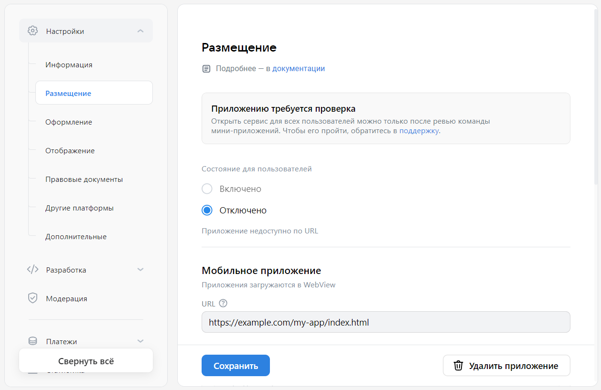

# Размещение

Раздел содержит настройки, которые необходимы для запуска мини-приложения из интерфейса ВКонтакте.

:::alert

Если настройки размещения не указаны, мини-приложение не будет работать.

:::

## Как открыть

[Откройте панель управления мини-приложением](mini-apps/settings/overview) и в меню слева выберите **Настройки**&nbsp;&rarr; **Размещение**.

## Как выглядит

<!-- exclusions/_assetsmini-apps/settings/platform-section.webp -->

## Кому доступно

Раздел доступен [администраторам](mini-apps/settings/managers) мини-приложения со следующими правами:

* Создатель мини-приложения.

* Администратор с полным доступом.

* Администратор с частичным доступом, с правом «Редактирование».

## Настройки

### Состояние для пользователей

Указывает, доступно ли мини-приложение пользователям ВКонтакте.

|  Возможные значения | Описание |
| --- | --- |
| **Включено** | Мини-приложение включено и видно всем пользователям ВКонтакте. Если мини-приложение опубликовано в каталоге, пользователи могут запускать его из каталога. Если мини-приложение пока не опубликовано, пользователи могут запускать его по прямой ссылке `https://vk.com/app{id}`. |
| **Отключено** | Мини-приложение доступно только его [администраторам](mini-apps/settings/managers) и [тестировщикам](mini-apps/settings/test-groups), но недоступно остальным пользователям ВКонтакте. Администраторы и тестировщики могут запускать приложение по прямой ссылке `https://vk.com/app{id}`. |

### Настройки платформ

Раздел содержит настройки запуска мини-приложения для различных платформ ВКонтакте: мобильное приложение, десктопная и мобильная версии сайта. Вы можете настроить запуск приложения на всех доступных платформах или выбрать только те, которые вам нужны.

| Раздел | Описание |
| --- | --- |
| **Мобильное приложение** | Настройки для запуска мини-приложения из мобильного приложения ВКонтакте для Android и iOS.&#x0d;&#x0a;&#x0d;&#x0a;На этих платформах мини-приложение будет открываться в элементе управления WebView и будет выглядеть похожим на обычные приложения для Android и iOS. |
| **Десктопная&nbsp;версия&nbsp;сайта** | Настройки для запуска мини-приложения из десктопной версии сайта ВКонтакте (vk.com). &#x0d;&#x0a;&#x0d;&#x0a;В браузере у пользователя будет открыта страница сайта vk.com, а мини-приложение будет загружено в HTML-элемент `<iframe>` на этой странице. |
| **Мобильная версия сайта** | Настройки для запуска мини-приложения из мобильной версии сайта ВКонтакте (m.vk.com). &#x0d;&#x0a;&#x0d;&#x0a;В браузере у пользователя будет открыта страница сайта vk.com, а мини-приложение будет загружено в HTML-элемент `<iframe>` на этой странице. |

#### URL

Адрес для запуска мини-приложения. Платформа отправит этот адрес в WebView или в `<iframe>` для загрузки.

Чтобы передать параметры, укажите их в URL после символа `?`, например `https://my-app.com/start?param1=value1`.

#### Режим разработки

Используйте эту настройку, чтобы включить или отключить режим разработки и чтобы указать адрес мини-приложения, который будет использоваться в этом режиме.

Режим разработки полезен, когда мини-приложение уже опубликовано в каталоге, но вам надо проверить изменения в нём. Этот режим работает для всех [администраторов](mini-apps/settings/managers) мини-приложения. Когда они запустят мини-приложение, платформа ВКонтакте загрузит его из адреса, указанного в настройке **Режим разработки**, а не из настройки **URL**. Для остальных пользователей мини-приложение продолжит открываться по **URL**, для них подмены не произойдёт.

#### Приоритеты URL для загрузки мини-приложения

При запуске мини-приложения администраторами ВКонтакте выбирает URL для загрузки приложения на каждой платформе в следующем порядке:

1. URL, указанный в настройках [тестовой группы](mini-apps/settings/test-groups) (если администратор включён в какую-либо тестовую группу). Этот URL имеет наивысший приоритет относительно остальных.

1. URL, указанный для режима разработки (если режим разработки включён для выбранной платформы).

1. URL, указанный в настройке [URL](#URL). Приоритет этого URL ниже адресов, указанных в режиме разработки или в тестовой группе.

## Удалить приложение

Чтобы удалить мини-приложение с платформы VK Mini Apps, в правом нижнем углу страницы нажмите **Удалить приложение**.

Кнопка **Удалить приложение** доступна только [создателю](mini-apps/settings/managers#Создатель) мини-приложения.

> Удалённое мини-приложение нельзя восстановить. Можно создать новое с другим идентификатором.

## Материалы по теме

* [Мини-приложения — Панель управления](mini-apps/settings/overview)

* [Мини-приложения — Первые шаги](mini-apps/getting-started)

* [Настройки (старая панель управления)](mini-apps/management/settings)
