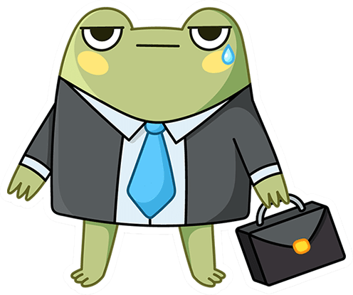

import Tabs from '@theme/Tabs';
import TabItem from '@theme/TabItem';

# Показательная страница

## Табы

### Сейчас так

#### Как запустить игру в Web

##### По прямой ссылке

Прямая ссылка — это ссылка, содержащая идентификатор игры, например:

* `https://vk.com/app1234567` — для десктопной версии сайта ВКонтакте, а также для мобильного приложения ВКонтакте для Android и iOS.

* `https://m.vk.com/app1234567` — для мобильной версии сайта ВКонтакте.

Чтобы запустить игру, откройте эту ссылку в браузере.

Идентификатор игры (цифры после `/app`) вы можете найти в настройках игры:

#### Как запустить игру в мобильном приложении

Пока игра не опубликована в каталоге, запустить её можно следующими способами.

##### Из списка недавно запущенных игр

1. [Запустите](#Как%20запустить%20игру%20по%20прямой%20ссылке) игру в десктопной версии сайта ВКонтакте. После этого она попадёт в список игр, которые были запущены недавно.

1. Откройте мобильное приложение ВКонтакте и запустите игру:

* Из блока **Мои игры** в мобильном приложении ВКонтакте для Android.

* Из блока **Недавно запущенные** в мобильном приложении ВКонтакте для iOS.

##### Из избранного

1. Откройте мобильное приложение ВКонтакте и перейдите в раздел **Мессенджер**.

1. Установите курсор в поле поиска, в разделе **Важное** выберите **Избранное** и отправьте ссылку на игру:

   `https://vk.com/app1234567`

   Вместо `1234567` укажите идентификатор вашей игры.

1. Нажмите на ссылку в отправленном сообщении. ВКонтакте запустит игру в элементе управления WebView.

   > При отправке сообщения мессенджер определяет, что ссылка указывает на игру, и добавляет сниппет игры к сообщению. Вы можете запустить игру, нажав на кнопку в сниппете.

### Можно так

#### Как запустить игру

<Tabs>
<TabItem value="в Web" label="В Web" default>

##### По прямой ссылке

Прямая ссылка — это ссылка, содержащая идентификатор игры, например:

* `https://vk.com/app1234567` — для десктопной версии сайта ВКонтакте, а также для мобильного приложения ВКонтакте для Android и iOS.

* `https://m.vk.com/app1234567` — для мобильной версии сайта ВКонтакте.

Чтобы запустить игру, откройте эту ссылку в браузере.

Идентификатор игры (цифры после `/app`) вы можете найти в настройках игры.

##### Через избранное

Откройте игру и добавьте её в избранное. Нажмите **Действия** и что-то там ещё.

Чтобы запустить игру, выберите её в левом меню. Также игры, добавленные в избранное, отображаются в разделе [Любимые игры](https://vk.com/games?act=profile).

</TabItem>
<TabItem value="в мобилке" label="В мобильном приложении">

##### Из списка недавно запущенных игр

1. [Запустите](#Как%20запустить%20игру%20по%20прямой%20ссылке) игру в десктопной версии сайта ВКонтакте. После этого она попадёт в список игр, которые были запущены недавно.

1. Откройте мобильное приложение ВКонтакте и запустите игру:

* Из блока **Мои игры** в мобильном приложении ВКонтакте для Android.

* Из блока **Недавно запущенные** в мобильном приложении ВКонтакте для iOS.

##### Из избранного

1. Откройте мобильное приложение ВКонтакте и перейдите в раздел **Мессенджер**.

1. Установите курсор в поле поиска, в разделе **Важное** выберите **Избранное** и отправьте ссылку на игру:

   `https://vk.com/app1234567`

   Вместо `1234567` укажите идентификатор вашей игры.

1. Нажмите на ссылку в отправленном сообщении. ВКонтакте запустит игру в элементе управления WebView.

   > При отправке сообщения мессенджер определяет, что ссылка указывает на игру, и добавляет сниппет игры к сообщению. Вы можете запустить игру, нажав на кнопку в сниппете.

</TabItem>
</Tabs>

## Красивые цветные плашки

:::note
Нейтральные серенькие
:::

:::tip
Зелёные
:::

:::info
Синие
:::

:::warning[Внимание!!1!1]
Предупреждающие оранжевые
:::

:::danger
Кричащие красные
:::

## Каты

### Сейчас так

#### Правила CSS

Наш пример хранит информацию о стилях веб-элементов в CSS-файлах. Мы указываем стили в соответствии с методологией [БЭМ (Блок, Элемент, Модификатор)](https://ru.bem.info/methodology/css/). То есть мы не указываем стили для тегов или идентификаторов, а работаем только с селекторами классов.

```CSS
/* Файл src/components/Products/Products.css */

.Products {  
  width: 100%;
  height: max-content;
  margin-bottom: 16px;
}

.Products_header {
  display: flex;
  flex-direction: row;
  align-items: center;
}

.Products_header_avatar {
  display: inline-block;
  margin-right: 5px;
  border-radius: 100%;
}

.Products_header_avatar__unload {
  opacity: 0;
}
```

### Можно так

Наш пример хранит информацию о стилях веб-элементов в CSS-файлах. Мы указываем стили в соответствии с методологией [БЭМ (Блок, Элемент, Модификатор)](https://ru.bem.info/methodology/css/). То есть мы не указываем стили для тегов или идентификаторов, а работаем только с селекторами классов.

<details>
  <summary>CSS</summary>

```CSS
/* Файл src/components/Products/Products.css */

.Products {  
  width: 100%;
  height: max-content;
  margin-bottom: 16px;
}

.Products_header {
  display: flex;
  flex-direction: row;
  align-items: center;
}

.Products_header_avatar {
  display: inline-block;
  margin-right: 5px;
  border-radius: 100%;
}

.Products_header_avatar__unload {
  opacity: 0;
}
```
</details>

## Таблицы

| Можно | И как оно? |
|---|---|
| Делать списки, которые не занимют 8 строк в MD | Потому что докузавр поддерживает html и сделать список просто как:<br/> - Дважды. <br/> - Два. |
| Вставлять инлайн иконки |  |
| И даже полноценные картинки |  |
| Использовать верхний и нижний индексы | Вот <sub>нижний</sub><br/>Вот <sup>верхний</sup> |
| Выкладывать файлы | <a target="_blank" href={ require("../static/img/khopper.png").default } download>скачай делового Хоппера</a>|