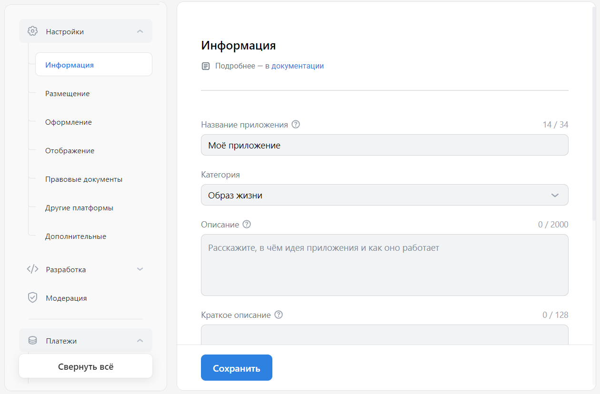

# Информация

Раздел содержит название, описание и другую информацию, которая отображается в [каталоге мини-приложений](mini-apps/catalog/getting-started) и в интерфейсе ВКонтакте.

## Как открыть

[Откройте панель управления мини-приложением](mini-apps/settings/overview) и в меню слева выберите **Настройки** → **Информация**.

## Как выглядит

<!-- exclusions/_assets/mini-apps/settings/general/information-page.webp -->

## Кому доступно

Раздел доступен [администраторам](mini-apps/settings/managers) мини-приложения со следующими правами:

* Создатель мини-приложения.

* Администратор с полным доступом.

* Администратор с частичным доступом, с правом «Редактирование».

## Настройки

### Название приложения

Название мини-приложения, как его видят пользователи в [каталоге](mini-apps/settings/design-examples#Каталог%20мини-приложений) мини-приложений, [сниппетах](mini-apps/settings/design-examples#Сниппеты%20в%20сообщениях) и других местах ВКонтакте.

Поддерживаются буквы, цифры, дефисы, пробелы, двоеточия и тире. Эмодзи использовать нельзя.

Размер: от 3 до 34 знаков.

### Категория

Категория мини-приложения. Эта настройка влияет на то, в какие [подборки в каталоге](mini-apps/promotion/featured) будет включено мини-приложение. Кроме того, ВКонтакте отображает категорию в некоторых [подборках](mini-apps/settings/design-examples#Подборки%20в%20каталоге%20в%20десктопной%20версии%20сайта) и в [сниппетах](mini-apps/settings/design-examples#Сниппеты%20в%20сообщениях).

> После публикации мини-приложения в каталоге категорию можно будет изменить только с помощью [сотрудников Поддержки](mini-apps/management/support).

### Описание

Описание мини-приложения видно на [экране «О приложении»](mini-apps/settings/design-examples#Экран%20«О%20приложении»%20в%20каталоге%20плагинов%20для%20сообществ) в [каталоге плагинов для сообществ](https://vk.com/community_apps), а также во [всплывающей карточке](mini-apps/settings/design-examples#Всплывающая%20карточка%20в%20каталоге%20плагинов%20для%20сообществ) в этом каталоге.

Максимальный размер: 2 000 символов.

### Краткое описание

Короткий текст, который показывается во [всплывающей карточке мини-приложения](mini-apps/settings/design-examples#Карточка%20мини-приложения) и в некоторых [подборках](mini-apps/settings/design-examples#Подборки%20в%20каталоге%20в%20мобильном%20приложении) в каталоге мини-приложений. Также краткое описание используется в [каталоге плагинов для сообществ](mini-apps/settings/design-examples#Каталог%20плагинов%20для%20сообществ).

Максимальный размер: 128 символов.

Если краткое описание отсутствует, платформа ВКонтакте будет использовать текст из настройки [Описание](#Описание).

### Короткий адрес

Часть адреса мини-приложения, которая идёт после имени сервера: `https://vk.com/<Адрес-приложения>`.

> Изменить короткий адрес можно после [публикации мини-приложения в каталоге](mini-apps/catalog/moderation).

Настройка **Короткий адрес** важна для продвижения мини-приложения. По умолчанию его URL выглядит как `https://vk.com/app12357`. Такой адрес трудно запомнить. Чтобы у мини-приложения был простой и понятный URL, например `https://vk.com/my_app`, измените его короткий адрес.

В коротком адресе приложения допустимы только латинские символы, подчёркивания и цифры. Пробелы, знаки препинания, слеши, кириллицу использовать не получится.

Если введённый адрес уже занят другим мини-приложением, игрой, пользователем или сообществом, вы увидите предупреждение.

Размер: от 5 до 32 символов.

### Официальное сообщество

Название сообщества, от имени которого вы сможете отправлять сообщения пользователям. Эта социальная механика важна для продвижения мини-приложения. Она позволяет рассказать пользователям о проводимых акциях, а также напомнить о мини-приложении тем, кто перестал его запускать. <!-- Подробности — в разделе [Личные сообщения от мини-приложения](TO_DO). -->

Выпадающий список содержит сообщества, в которых [создатель](mini-apps/settings/managers#Создатель) мини-приложения является администратором.

> Сменить сообщество можно раз год. Отсчёт начинается с момента прохождения модерации и публикации мини-приложения в каталоге. До этого времени сообщество можно менять произвольно.

### Запуск приложения из сообщества

Когда эта настройка включена, мини-приложение можно [добавить в сообщество](mini-apps/development/community-apps) и запускать оттуда.

<!-- exclusions/_assets/mini-apps/settings/mini-app-in-community.webp

 -->

> В сообщество можно добавить только одно мини-приложение. Но вы можете добавить в сообщество до пяти плагинов. Подробнее о создании и настройке — в разделе [Плагины для сообществ](mini-apps/development/community-apps).

### Название кнопки

Название кнопки, которая будет показываться на карточке приложения в сообществе. Это название можно переопределить в настройках сообщества.

### Идентификаторы Apple

Настройки этой группы используются для публикации мини-приложения в каталоге на iOS или для подачи заявки на запуск в WebView на iOS. Если идентификаторы Apple не настроены, ваше приложение на iOS будет открываться в мобильном браузере. 

В настройках **Apple Developer Team ID** и **Apple Developer Team Name** необходимо указать идентификатор и имя вашей команды разработки в Apple Developer Program. Вы можете найти эти значения на [сайте Apple Developer Program](https://developer.apple.com/programs/).

## Материалы по теме

* [Мини-приложения — Панель управления](mini-apps/settings/overview)

* [Где используются настройки в интерфейсе ВКонтакте](mini-apps/settings/design-examples)

* [Информация (старая панель управления)](mini-apps/management/information)
