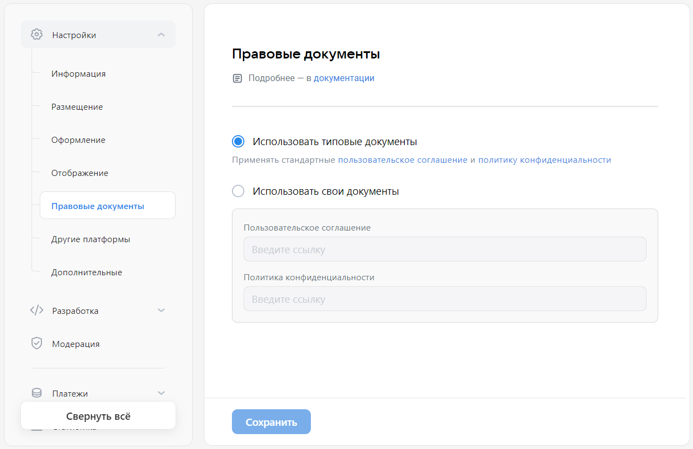

# Правовые документы

В разделе **Правовые документы** вы можете указать ссылки на пользовательское соглашение и политику конфиденциальности, которые использует ваше мини-приложение. Выберите стандартные документы или добавьте ссылки на собственные.

Эти документы нужны, чтобы пройти [модерацию](mini-apps/settings/moderation) перед публикацией мини-приложения в [каталоге](mini-apps/catalog/getting-started).

Вы можете самостоятельно добавить эти ссылки в интерфейсе вашего мини-приложения, чтобы познакомить пользователей с вашими правилами.

## Как открыть

[Откройте панель управления мини-приложением](mini-apps/settings/overview) и в меню слева выберите **Общие настройки&nbsp;&rarr; Правовые документы**.

## Как выглядит

<!--exclusions/_assetsmini-apps/settings/general/legal-docs-page.webp-->

## Кому доступно

Раздел доступен [администраторам](mini-apps/settings/managers) мини-приложения со следующими правами:

* Создатель мини-приложения.

* Администратор с полным доступом.

* Администратор с частичным доступом, с правом «Редактирование».

## Материалы по теме

* [Мини-приложение  — Панель управления](mini-apps/settings/overview)

* [Информация (старая панель управления)](mini-apps/management/information)
