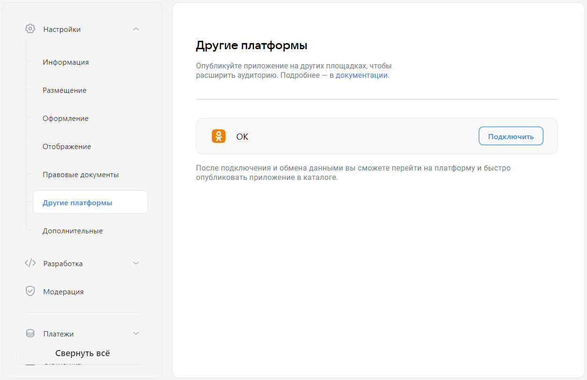

# Другие платформы

Используйте раздел **Другие платформы**, чтобы управлять публикацией мини-приложений на других платформах компании VK. Сейчас вы можете добавлять или снимать с публикации мини-приложение в социальной сети [Одноклассники](https://ok.ru).

## Как открыть

[Откройте панель управления мини-приложением](mini-apps/settings/overview) и в меню слева выберите **Общие настройки&nbsp;&rarr; Другие платформы**.

## Как выглядит

<!-- exclusions/_assetsmini-apps/settings/general/other-platforms-page.webp -->

## Кому доступно

Раздел доступен только [создателю](mini-apps/settings/managers#Создатель) мини-приложения.

## Как использовать

В блоке **Одноклассники** (**ОК**) нажмите **Привязать ОК ID** или **Подключить** и следуйте инструкциям на экране. Подробности — в разделе [Размещение мини-приложения в Одноклассниках](mini-apps/publishing/other-platforms/odnoklassniki).

ВКонтакте автоматически создаст приложение в Одноклассниках с данными вашего мини-приложения. Настройки этого приложения будут скопированы из настроек вашего мини-приложения. Приложения будут связаны: если вы измените настройки мини-приложения ВКонтакте, изменения распространятся и на приложение в Одноклассниках.

## Что означает отмена

После создания приложения в Одноклассниках кнопка **Подключить** в панели управления изменится на **Отменить**. Если вы нажмёте **Отменить**, связь между вашим мини-приложением ВКонтакте и приложением в Одноклассниках будет разорвана. Изменения настроек ВКонтакте не будут приводить к изменениям настроек на стороне Одноклассников. Само приложение не будет удалено из Одноклассников.

Вы можете восстановить связь в любой момент, если нажмёте **Подключить** опять.

## Материалы по теме

* [Мини-приложение  — Панель управления](mini-apps/settings/overview)

* [Информация (старая панель управления)](mini-apps/management/information)
